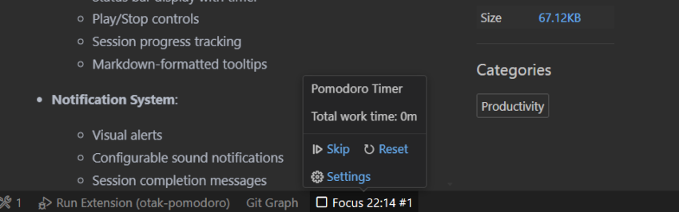
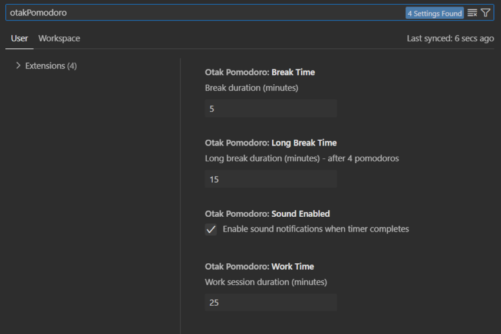

<p align="center">
  <h1 align="center">otak-pomodoro</h1>
  <p align="center">A minimalist Pomodoro Timer for VS Code - Enhance your productivity with customizable work/break cycles, status bar integration, and sound notifications.</p>
</p>

---

## Usage



1. Find the timer in your VS Code status bar
2. Click to start your Pomodoro session
3. Get notified when it's time to switch modes
4. Track your progress with session counter

## Features

otak-pomodoro is a streamlined VS Code extension that helps you maintain focus and manage your work/break cycles effectively.

### Key Features

- **Timer Modes**:
  - Focus Time (25 minutes)
  - Short Break (5 minutes)
  - Long Break (15 minutes, every 4 sessions)

- **Visual Integration**:
  - Status bar display with timer and session count
  - Play/Stop controls
  - Session progress tracking
  - Rich tooltips with quick actions

- **Timer Controls**:
  - Start/Stop timer
  - Skip current session
  - Reset timer and progress
  - Quick access to settings

- **Notification System**:
  - Visual progress notifications
  - Three beep sound notifications (using VSCode's native audioCues)
  - Session completion messages
  - Mode transition alerts

- **Customization Options**:
  - Adjustable session durations
  - Sound notification toggle
  - Real-time configuration updates

## Requirements

- Visual Studio Code ^1.97.0

## Installation

1. Install the extension from VS Code Marketplace
2. Look for the timer in your status bar
3. Click to start your first session
4. Configure settings via tooltip or command palette

## Extension Settings



This extension contributes the following settings:

- `otakPomodoro.workTime`: Duration of focus sessions (default: 25 minutes)
- `otakPomodoro.breakTime`: Duration of break sessions (default: 5 minutes)
- `otakPomodoro.longBreakTime`: Duration of long breaks (default: 15 minutes)
- `otakPomodoro.soundEnabled`: Enable/disable sound notifications (default: true)

## Commands

- `otak-pomodoro.toggleTimer`: Start/Stop the Pomodoro timer
- `otak-pomodoro.skipTimer`: Skip to next session (Focus/Break)
- `otak-pomodoro.resetTimer`: Reset the current session and counter

## Status Bar Display

The extension shows the following information in your status bar:

```
$(play) Focus 25:00 #1      // When paused, focus mode
$(debug-stop) Break 05:00 #2  // When running, break mode
```

With a detailed tooltip showing:
```markdown
Pomodoro Timer

---
$(debug-continue) Skip    $(refresh) Reset

$(settings-gear) Settings
```

The tooltip provides quick access to:
- Skip current session
- Reset timer and progress
- Open extension settings

## Notifications

The extension provides several types of notifications:

1. **Timer Completion**:
   - Visual notification showing mode change
   - Three beep sounds (when enabled)
   - Displays for 8 seconds

2. **Session Skip**:
   - Visual confirmation of mode change
   - Displays for 3 seconds

3. **Timer Reset**:
   - Visual confirmation
   - Displays for 3 seconds

## Contributing

Contributions are welcome! Please feel free to submit a Pull Request. For major changes, please open an issue first to discuss what you would like to change.

## License

This project is licensed under the MIT License - see the [LICENSE](LICENSE) file for details.

---

For more information, visit the [GitHub repository](https://github.com/tsuyoshi-otake-system-exe-jp/otak-pomodoro).

Part of the [otak-series](https://marketplace.visualstudio.com/search?term=otak&target=VSCode) VS Code extensions.
